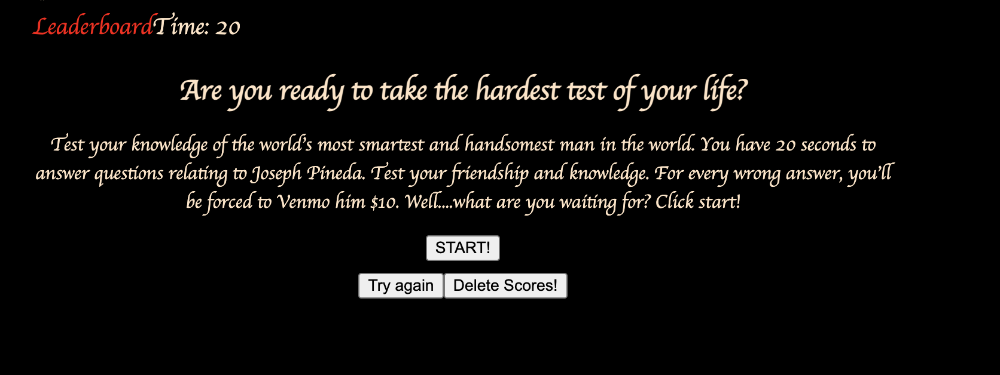
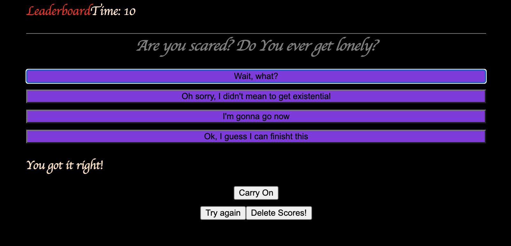
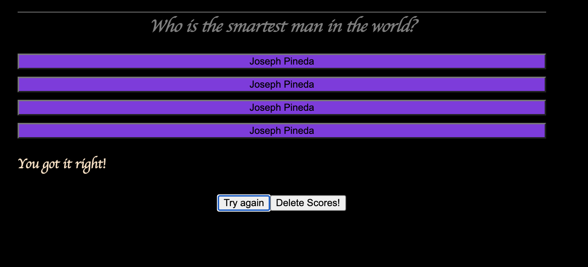

# webapischallenge

# Module 4

# Process

I created a timed questionaire. I relied on a YouTube video I found, but I also looked at my previous class recordings.

Hope you enjoy don't it or you owe me $10.

